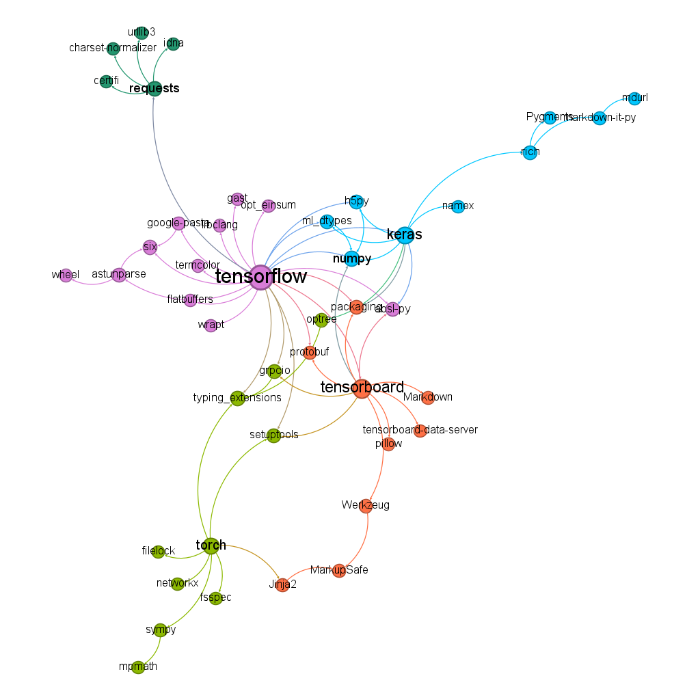

# Análise de Redes de Dependências no Ecossistema de IA em Python
 
 
 


**Autor(a):** Alice Maria Fonseca Victorino Freire

## 1. Introdução
Este projeto modela e analisa o ecossistema de bibliotecas de **Inteligência Artificial em Python** como um grafo de dependências.  
O objetivo é utilizar a **teoria dos grafos** para explorar a estrutura, interconexões e filosofias de design de pacotes populares em domínios como:
- Manipulação de Dados  
- Visualização de Dados  
- Visão Computacional  
- Deep Learning  

## 2. Metodologia
### 2.1. Coleta de Dados e Modelagem dos Grafos
Os dados foram coletados via `pip` e `pipdeptree`, modelando as relações de dependência com **NetworkX**.  
Os grafos resultantes possuem:

- **Direcionamento e não ponderação:** cada aresta `A → B` indica "A depende de B".  
- **Coocorrência implícita:** nós compartilhados entre ecossistemas (ex.: `numpy`) indicam dependência comum.

### 2.2. Análise de Redes

#### Quantitativa
- Número de **nós** e **arestas**  
- Grau, distribuição de grau e densidade da rede  
- **Assortatividade de grau**: tendência de nós com graus semelhantes se conectarem

#### Qualitativa e Estrutural
- Nós mais influentes pelo grau  
- Estrutura de comunidades via modularidade (utilizando Gephi)

### 2.3. Visualização no Gephi
- **Cores:** distinguir nós por tema ou módulo  
- **Tamanho dos nós:** representa centralidade (grau)  
- **Layout:** ForceAtlas2 para agrupar comunidades e destacar a estrutura

## 3. Estrutura do Projeto
O repositório está organizado da seguinte forma:

```
├── README.md                 
├── notebook.ipynb            <-- Notebook principal com todo o código
├── json_data/                <-- Subpasta com dependências das bibliotecas
│   ├── pandas.json
│   ├── numpy.json
│   └── ...
├── gephi/              <-- Subpasta com os grafos exportados para o Gephi
│   ├── deep_learning.gexf
│   └── ...
├── assets/            <-- Subpasta com as imagens finais dos grafos
    ├── analise_quantitativa
    ├── grafos
    └── legendas
└── requirements.txt <-- Dependências para este projeto
```

## 4. Como Executar o Projeto

1. Clone o repositório
2. Crie e ative um ambiente virtual (recomendado) 
```bash
python -m venv venv
# Linux / Mac
source venv/bin/activate
# Windows
venv\Scripts\activate
```
3. Instale as dependências do projeto
```bash
pip install -r requirements.txt
```
4. Execute o notebook `notebook.ipynb` (opcional)

> Todos os arquivos JSON de dependências e gráficos já estão incluídos no repositório, portanto este passo só é necessário caso alguma biblioteca mude suas dependências ou você queira regenerar os dados.

5. Visualização no Gephi
- Importe para o Gephi os arquivos .gexf gerados pelo notebook (ou os que já estão no repositório).
- Utilize Layout ForceAtlas2, Partição (tema/modularidade) e Ranking (PageRank) para explorar os grafos.

## 5. Resultados e Discussão

### 5.1. Visualização de Dados
**Bibliotecas:** Matplotlib, Altair, Seaborn, Plotly


**Métricas:**
- Nós: 26 | Arestas: 33  
- Densidade: 0.0508 → conexões específicas  
- Assortatividade: -0.198 → rede disassortativa, hub central `matplotlib`
- Tamanho dos nós baseado no grau

**Estrutura e Hubs:**
- `Matplotlib`:  Hub central, base para outras bibliotecas como Seaborn.  
- `Seaborn`: camada de abstração sobre Matplotlib, simplificando gráficos estatísticos.  
- `Altair`: ecossistema independente, com abordagem declarativa.  
- `Plotly`: mais isolado e autossuficiente, com poucas dependências compartilhadas.  

**Distribuição de grau:**  


- Padrão de cauda longa: a maioria dos nós (10) possui 1 conexão, enquanto o hub `matplotlib` se destaca com 10 conexões.

---

### 5.2. Visão Computacional
**Bibliotecas:** OpenCV, Torchvision, Scikit-image

  


**Métricas:**
- Nós: 20 | Arestas: 26  
- Densidade: 0.0684 → conexões especializadas  
- Assortatividade: -0.4758 → rede disassortativa, com principal hub sendo `torch`  
- Tamanho dos nós baseado no grau   

**Distribuição de grau:**  

  

- Padrão de **cauda longa**: a maioria dos nós (14) possui 1-2 conexões  
- Hubs principais: `numpy` (8 conexões) e `torch` (6 conexões)  

**Modularidade:**

Gráfico gerado utilizando a ferramenta de detecção de comunidades do Gephi.

 

- **Ecossistema Científico Clássico (clusters verde e laranja):**  
  Centrado em `numpy`, `scipy` e `scikit-image`, base para manipulação de dados e processamento de imagens tradicional.

- **Ecossistema de Deep Learning (clusters roxo e azul):**  
  Centrado em `torch`, incluindo dependências de baixo nível (`nvidia-*`) para aceleração em GPU.

- **Ponte entre os mundos:**  
  `Torchvision` conecta os ecossistemas, dependendo de `numpy` e `Pillow` para preparar dados que o `torch` utiliza.

--- 

### 5.3. Deep Learning
**Bibliotecas:** TensorFlow e PyTorch

  


**Métricas:**
- Nós: 45 | Arestas: 63  
- Densidade: 0.0318 → ecossistemas especializados  
- Assortatividade: -0.1021 → hubs centrais `TensorFlow`, `Torch`  
- Tamanho dos nós baseado no grau   
 
**Distribuição de grau:**  
 
- Padrão de **cauda longa** mais extremo que os anteriores: quase metade dos nós (>20) possui apenas 1 conexão  
- Hub dominante: `TensorFlow` com 21 conexões 

**Modularidade:**

Gráfico gerado utilizando a ferramenta de detecção de comunidades do Gephi.

  

- **Ecossistema TensorFlow (cluster verde/azul):**  
  Centrado em `TensorFlow`, inclui `Keras`, `TensorBoard` e `numpy`. Um universo completo e autocontido.

- **Ecossistema PyTorch (cluster roxo):**  
  Centrado em `Torch`, acoplado a bibliotecas `nvidia-*`. Funciona de forma independente do TensorFlow.

- **Clusters de utilidades:**  
  Pequenos clusters para funcionalidades específicas, como `requests` (web) e `rich` (formatação de texto).  

--- 

### 5.4. Ecossistema de IA Completo

**Bibliotecas por categoria:**
- Dados: `pandas`, `numpy`  
- Visualização: `matplotlib`, `seaborn`, `plotly`, `altair`  
- Visão Computacional: `opencv-python`, `scikit-image`, `torchvision`  
- Deep Learning: `tensorflow`, `torch`  
- ML Clássico: `scikit-learn` 

  


**Métricas:**
- Nós: 74 | Arestas: 116  
- Densidade: 0.0214 → baixa  
- Assortatividade: -0.2097  
- Grau máximo: 21 (`TensorFlow`), hubs importantes: `numpy`, `matplotlib`
- - Tamanho dos nós baseado no **grau de entrada**; nesse sentido, a biblioteca mais importante é a `numpy`, porque muitas outras bibliotecas dependem dela.

**Distribuição de grau:**  

 

- Cauda longa pronunciada: ~28 nós (40%) possuem apenas 1 conexão  
- Hubs principais (`tensorflow`, `numpy`, `matplotlib`) concentram conectividade, sustentando a rede  

**Modularidade:**

  

- **Ecossistema Científico Clássico (cluster verde):**  
  Centrado em `numpy`, é o núcleo do ecossistema, conectando Machine Learning Clássico (`scikit-learn`), Manipulação de Dados (`pandas`) e Visualização (`matplotlib`). Base indispensável para todas as outras especialidades.

- **Deep Learning (clusters roxo e azul):**  
  Ecossistemas `TensorFlow` e `PyTorch` paralelos e autossuficientes, mas dependem do cluster clássico para pré-processamento e manipulação de dados.

- **Importância do `Numpy`**  
  Elemento central que conecta todos os domínios, permitindo interoperabilidade entre manipulação de dados, treinamento de modelos e visualização. É a ponte universal que garante coesão ao ecossistema.


